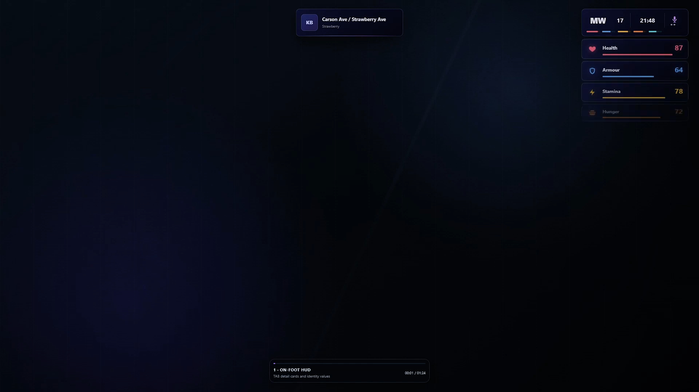
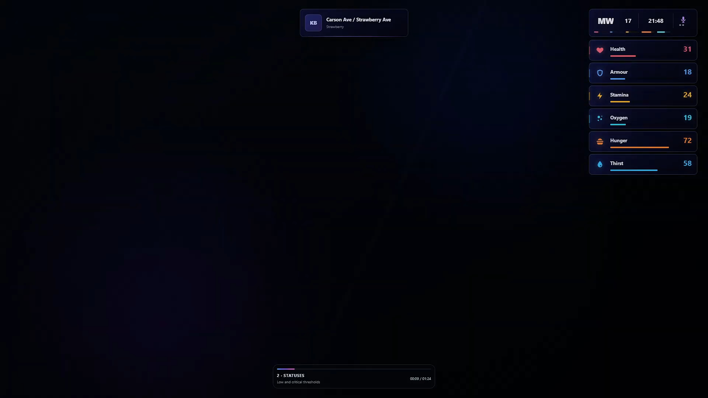
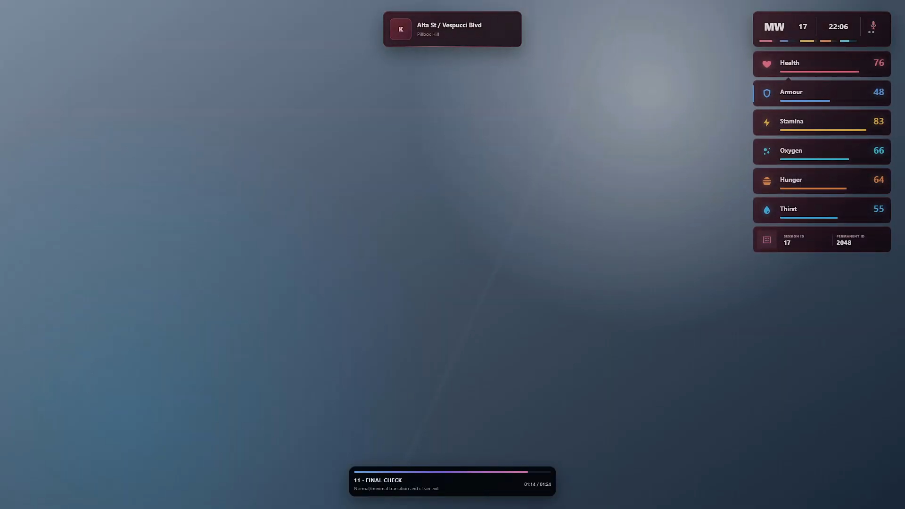
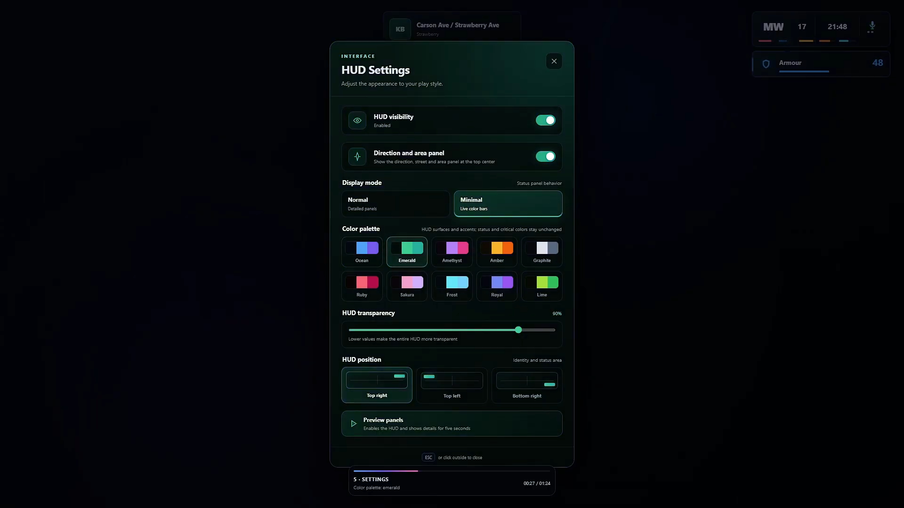
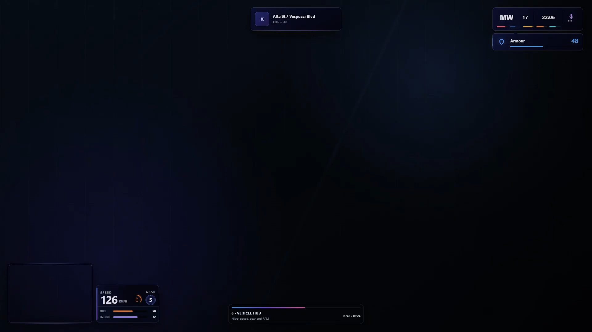
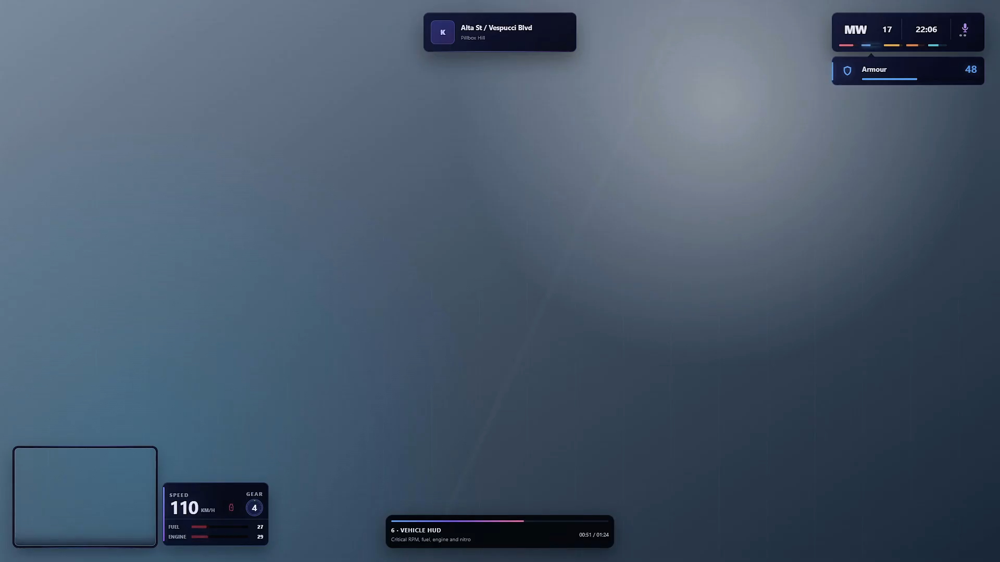

# Mirac Wicked HUD

[](https://fivem.net/)
[](https://github.com/Qbox-project/qbx_core)
[](https://github.com/overextended/ox_lib)
[](CHANGELOG.md)
[](LICENSE)

A modern, configurable and open-source FiveM HUD built for Qbox and a
standard, unmodified ox_lib installation.

Mirac Wicked HUD provides player status panels, a vehicle HUD, minimap
handling, voice indicators, themes, notifications, TextUI and a complete
in-game settings interface. Framework-specific behavior is isolated behind
bridges so server owners can configure integrations without editing the NUI.

## Preview

[Watch the complete Mirac Wicked HUD demo on YouTube](https://youtu.be/0BhiHlxuI8k)

<table>
  <tr>
    <td></td>
    <td></td>
  </tr>
  <tr>
    <td></td>
    <td></td>
  </tr>
  <tr>
    <td></td>
    <td></td>
  </tr>
</table>

## Highlights

- Health, armour, stamina, oxygen, hunger and thirst indicators
- Normal and minimal layouts with critical-status reveal behavior
- Vehicle speed, RPM-aware gear ring, fuel, engine, nitro and seatbelt HUD
- Synchronized minimap and vehicle-panel transitions
- Native, state-bag, export and custom fuel adapters
- Automatic pma-voice detection plus Enhanced/native voice support
- Whisper, normal and shout indicators with optional shout auto-reset
- Resource-scoped notifications and single-owner TextUI
- QB and ESX notification format adapters
- Ten palettes, global opacity and three HUD positions
- English and Turkish localization
- Client KVP settings with no additional SQL table
- Strict NUI callbacks and server-authoritative initial player data

## Requirements

- [qbx_core](https://github.com/Qbox-project/qbx_core)
- [ox_lib](https://github.com/overextended/ox_lib)

The HUD does not require ox_inventory, ox_target, pma-voice or a third-party
fuel resource unless you choose an adapter that depends on one of them.

## Installation

1. Download the release archive.
2. Copy `mirac_wicked_hud` to `resources/[local]/`.
3. Keep the resource folder name exactly `mirac_wicked_hud`.
4. Start the dependencies before the HUD:

```cfg
setr ox:locale "en"

ensure ox_lib
ensure qbx_core
ensure mirac_wicked_hud
```

Use `setr ox:locale "tr"` for Turkish.

See the [English installation guide](mirac_wicked_hud/INSTALL.md) or
[Turkish installation guide](mirac_wicked_hud/INSTALL_TR.md) for fuel, voice,
state-bag and troubleshooting details.

## Player commands

| Command | Description |
| --- | --- |
| `/hud` | Toggle HUD visibility |
| `/hudsettings` / `/hudayar` | Open HUD settings |
| `/hudminimal` | Toggle normal and minimal layouts |
| `/hudposition` / `/hudkonum` | Select or cycle the HUD position |
| `/hudreset` | Restore local visual settings |
| `/hudrefresh` / `/hudyenile` | Rebuild the local HUD presentation |

## Integration example

```lua
exports.mirac_wicked_hud:notify({
    id = 'job-status',
    title = 'Information',
    description = 'Your status was updated.',
    type = 'success',
    duration = 4000
})

exports.mirac_wicked_hud:showTextUI('door', '[E] Interact', {
    icon = 'hand',
    iconColor = '#60a5fa'
})
```

Server-side targeted notification:

```lua
exports.mirac_wicked_hud:notifyPlayer(source, {
    title = 'Paycheck',
    description = 'Your paycheck was deposited.',
    type = 'success'
})
```

The full export, event and configuration reference is available in
[the resource documentation](mirac_wicked_hud/README.md).

## ox_lib boundary

The resource uses a normal ox_lib installation for callbacks, locale,
keybinds, cache and other library services. Wicked HUD notifications and
TextUI are owned by this resource. Direct `lib.notify`, `lib.showTextUI`,
dialog, progress and context-menu calls continue to use the server owner's
normal ox_lib design.

No ox_lib replacement or overlay is included.

## Repository layout

- `mirac_wicked_hud/` — installable FiveM resource
- `assets/screenshots/` — repository preview images
- `CHANGELOG.md` — release history
- `CONTRIBUTING.md` — contribution and validation guidance
- `SECURITY.md` — security reporting policy

## Documentation

- [Complete English reference](mirac_wicked_hud/README.md)
- [Complete Turkish reference](mirac_wicked_hud/README_TR.md)
- [English installation guide](mirac_wicked_hud/INSTALL.md)
- [Turkish installation guide](mirac_wicked_hud/INSTALL_TR.md)
- [Changelog](CHANGELOG.md)
- [Audio asset notices](mirac_wicked_hud/ASSET_LICENSES.md)

## License

Source code is released under the [MIT License](LICENSE).

Dependencies are not bundled and remain subject to their own licenses. Audio
assets are documented separately in
[ASSET_LICENSES.md](mirac_wicked_hud/ASSET_LICENSES.md).
